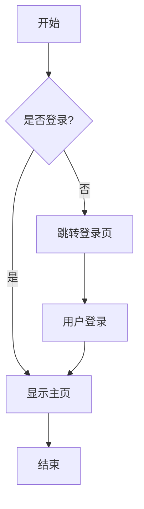
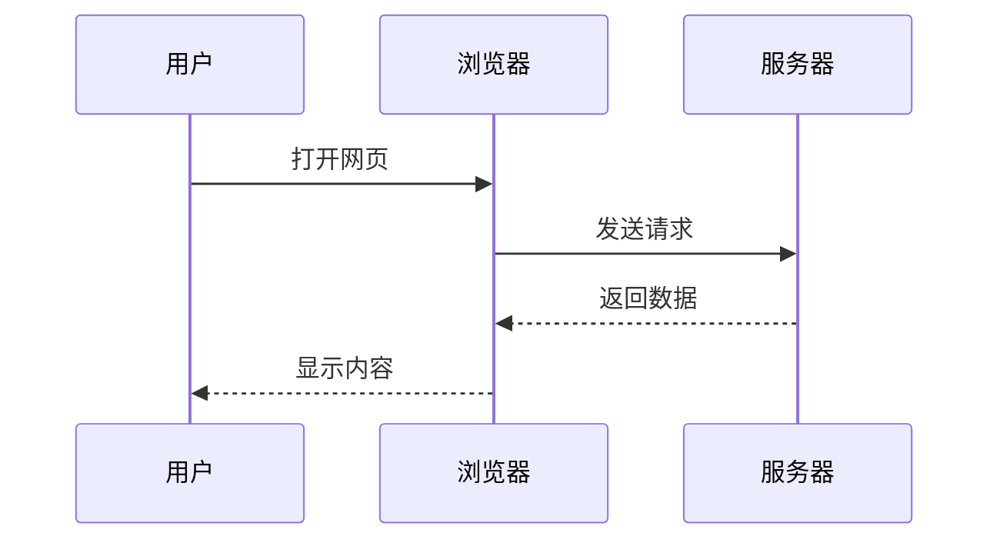
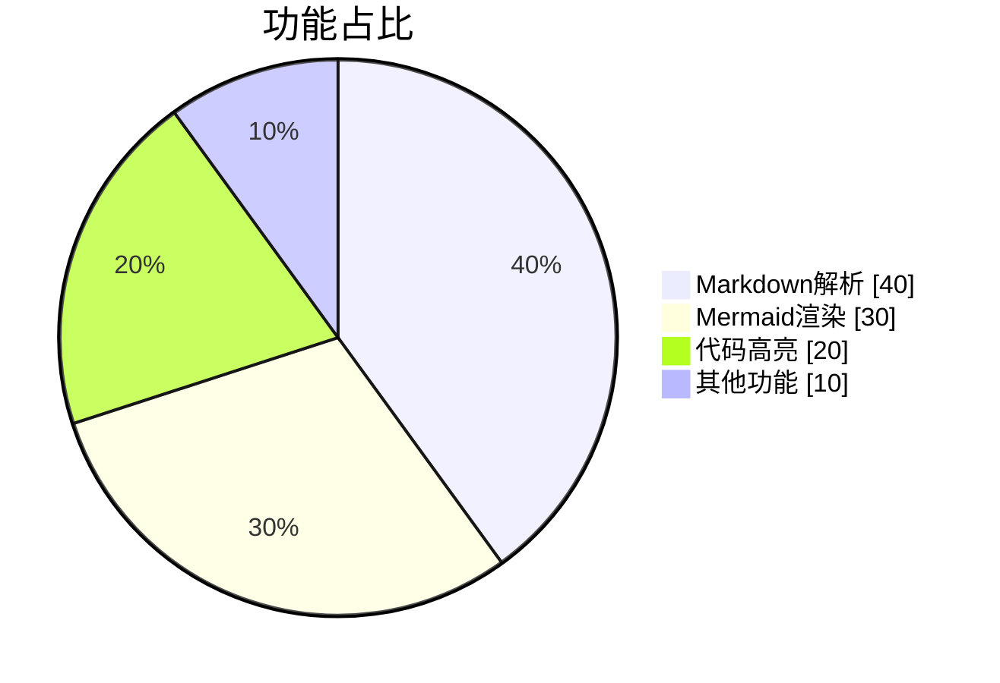

# Markdown Viewer 示例文档

这是一个用于测试 Markdown Viewer 功能的示例文档。

## 功能特性

### 1. Markdown 基础语法

支持所有标准 Markdown 语法：

- **粗体文本**
- *斜体文本*
- `行内代码`
- ~~删除线~~

### 2. 代码块

```javascript
function hello() {
    console.log("Hello, Markdown Viewer!");
}
```

### 3. 表格

| 功能 | 状态 | 说明 |
|------|------|------|
| Markdown 解析 | ✅ | 支持 |
| Mermaid 图表 | ✅ | 支持 |
| 代码高亮 | ✅ | 支持 |
| 目录导航 | ✅ | 支持 |

## Mermaid 图表示例

### 流程图



### 时序图



### 饼图



## 引用块

> Markdown 是一种轻量级标记语言，它允许人们使用易读易写的纯文本格式编写文档。
> 
> — John Gruber

## 任务列表

- [x] 支持 Markdown 解析
- [x] 支持 Mermaid 图表
- [x] 支持代码高亮
- [x] 支持目录导航
- [x] 支持深色模式
- [ ] 更多功能开发中...

---

感谢使用 Markdown Viewer！
