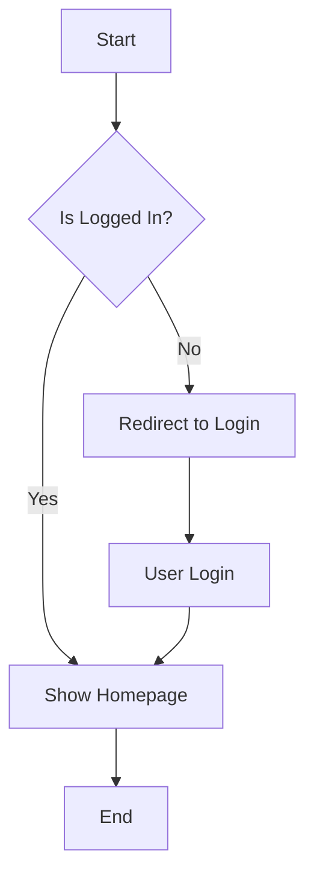
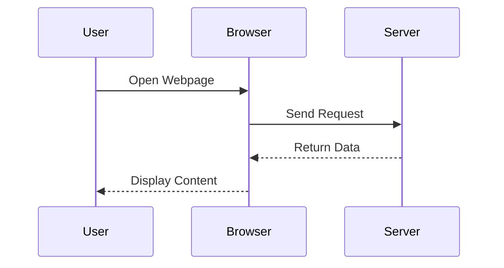
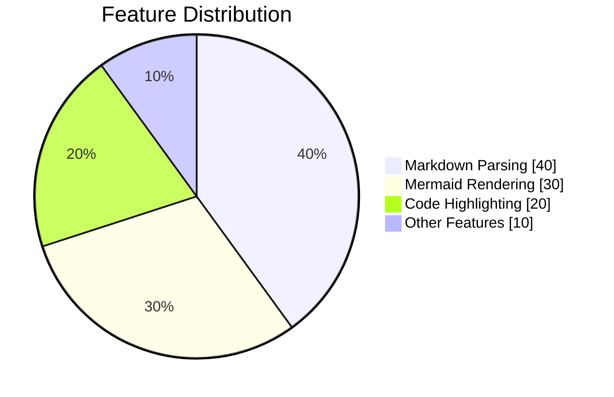

# Markdown Viewer Example Document

This is a sample document for testing Markdown Viewer features.

## Features

### 1. Basic Markdown Syntax

Supports all standard Markdown syntax:

- **Bold text**
- *Italic text*
- `Inline code`
- ~~Strikethrough~~

### 2. Code Blocks

```javascript
function hello() {
    console.log("Hello, Markdown Viewer!");
}
```

### 3. Tables

| Feature | Status | Description |
|---------|--------|-------------|
| Markdown Parsing | ✅ | Supported |
| Mermaid Diagrams | ✅ | Supported |
| Code Highlighting | ✅ | Supported |
| Table of Contents | ✅ | Supported |

## Mermaid Diagram Examples

### Flowchart



### Sequence Diagram



### Pie Chart



## Blockquote

> Markdown is a lightweight markup language that allows people to write documents using an easy-to-read and easy-to-write plain text format.
> 
> — John Gruber

## Task List

- [x] Support Markdown parsing
- [x] Support Mermaid diagrams
- [x] Support code highlighting
- [x] Support table of contents
- [x] Support dark mode
- [ ] More features in development...

---

Thanks for using Markdown Viewer!
